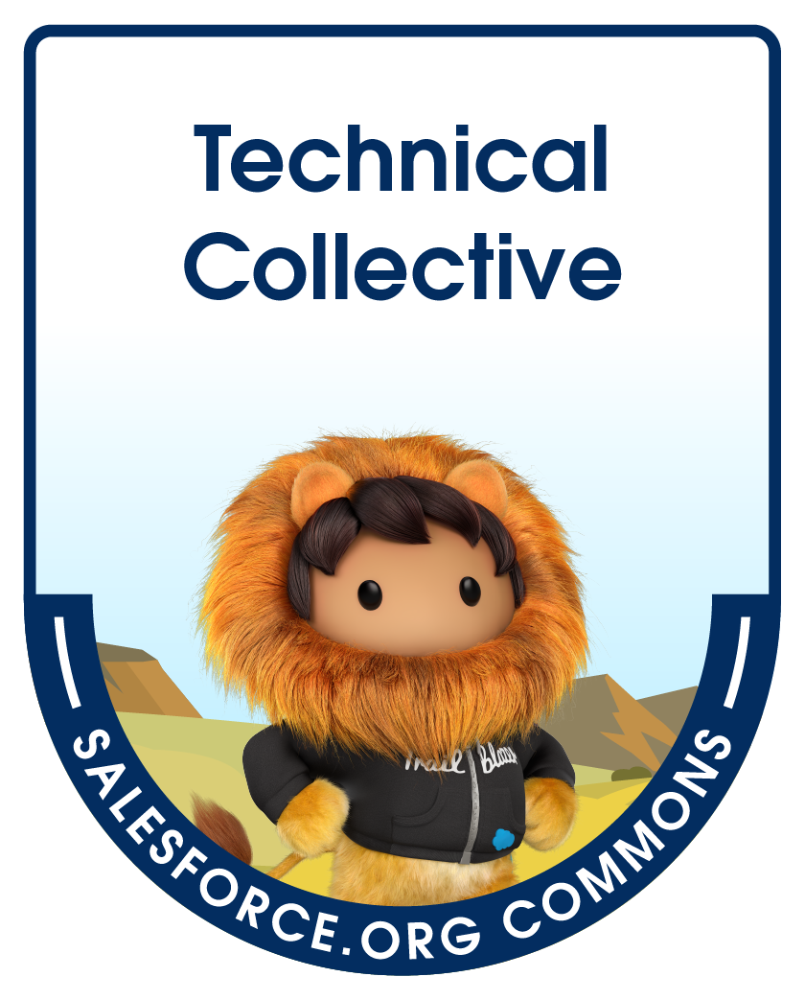

<!-- LOGO (top-center) -->

  

## What is The Technical Collective?

This project was born from the age-old problem in the Salesforce ecosystem. Junior admins don’t have enough work experience to land their first job role. Nonprofits and charities have donated Salesforce licenses, but need help either getting started or maintaining their systems. Technical experts want to support, but don’t have the structure to properly volunteer their time. 

A group of us got together at the Salesforce Commons January 2023 sprint and put together a program to upskill inexperienced admins to help nonprofits make the most of their Salesforce platform with the added support of a group of experienced Salesforce professionals.

---

## Who can participate?

**Nonprofit & Charities:** Nonprofit organisations can benefit from either pro-bono or compensated support on a scoped piece of Salesforce project work. We know that nonprofit organisations are often short on resources and can benefit from additional support, whether it is an update to the existing processes, creating some reports & dashboards or helping to document the system. The nonprofits supported will be small- to mid-sized nonprofits leveraging donated Salesforce licenses through the Power of Us Program.

**Learn more as a nonprofit**

**Junior Salesforce Professionals:** Junior Salesforce professionals will be individuals who have already upskilled in Salesforce by earning at least one certification, but are seeking work experience to add to their CV.

**Learn more as Salesforce Professionals**

**Technical Experts:** The team of technical experts are seasoned Salesforce professionals coming with at least 5 years of experience in the Salesforce ecosystem. They include Salesforce MVPs, Champions and volunteers with many collective years of experience.

**Learn more as Technical Experts**

---

## Meet the team

**Steering committee**

* Silvia Denaro  
* Nathaniel Sombu  
* Pei Mun Lim  
* Vicki Moritz-Henry  
* Claire Jones  
* Lawrence Newcombe  

We are a **Salesforce Commons** project and benefit from the support of the Salesforce team.

> *Special thanks to the volunteers at Salesforce Commons sprints who keep the project moving forward—this initiative wouldn’t be here without you!*
